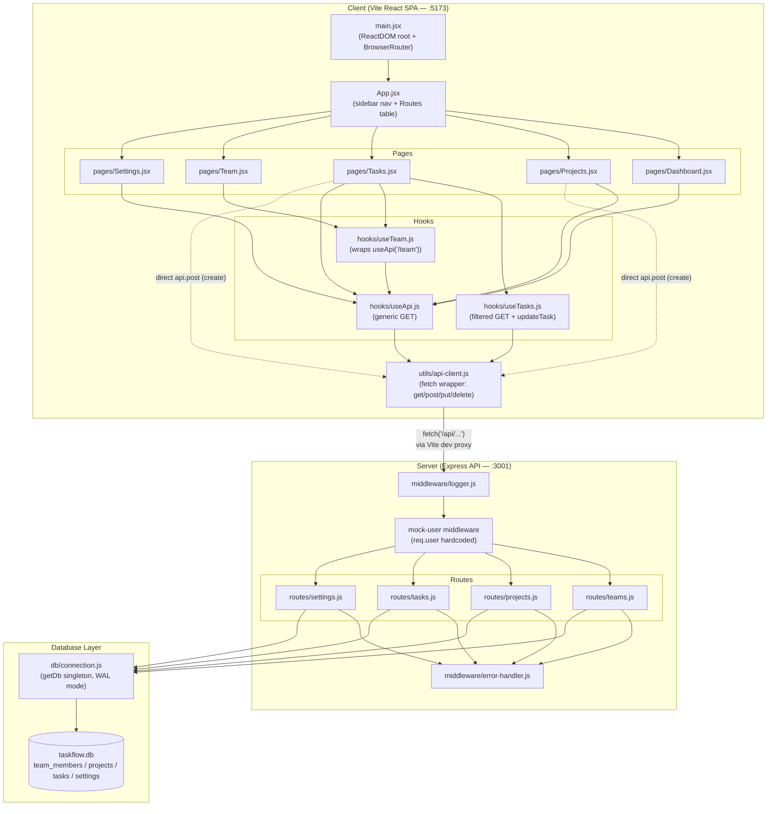

# Architecture Overview

## System Architecture

TaskFlow is a classic client-server app: a Vite React SPA talking to an Express REST API backed by SQLite.



### Layers

- **Client** — Vite React 18 SPA. `client/src/main.jsx` mounts `<App />` inside `<BrowserRouter>`. `client/src/App.jsx` renders a fixed sidebar plus a `<Routes>` table (`/`, `/projects`, `/tasks`, `/team`, `/settings`). *Known bug:* the sidebar's Settings `NavLink` points to `/setting` (singular) instead of `/settings`.
- **Server** — `server/index.js` builds the Express app: `cors()`, `express.json()`, `logger` middleware, then a hardcoded mock-auth middleware that stamps every request with `req.user = { id: 1, name: 'You', role: 'Product Manager' }` (no real auth). Mounts four routers under `/api/team`, `/api/projects`, `/api/tasks`, `/api/settings`, plus `/api/health`, with `errorHandler` last. `app.listen` is skipped under Vitest so API tests can import the same `app` directly.
- **Database** — `server/db/connection.js` is a lazy singleton: `getDb()` opens `better-sqlite3` against `server/taskflow.db`, sets WAL mode + foreign keys, and auto-bootstraps from `schema.sql` + `seed.sql` on first run. `server/db/schema.sql` defines `team_members`, `projects` (FK → `team_members`), `tasks` (FK → `team_members`, `projects`), and a key/value `settings` table.
- **Tests** — `tests/api/*.test.js` hit the Express `app` object directly; `tests/components/*.test.jsx` render components with React Testing Library.

### Data flow example: loading and filtering tasks

1. `client/src/pages/Tasks.jsx` holds `filters` state and calls `useTasks(filters)`.
2. `client/src/hooks/useTasks.js` builds a query string, calls `api.get('/tasks?...')`.
3. `client/src/utils/api-client.js` prefixes `/api`, sets JSON headers, `fetch()`s, throws on non-2xx.
4. `client/vite.config.js`'s dev proxy forwards `/api/*` from `:5173` to `:3001`.
5. `server/routes/tasks.js` `GET /` builds a parameterized SQL query from `req.query` and runs it via `db.prepare(...).all(...)`.
6. `server/db/connection.js`'s `getDb()` singleton executes the joined query against `tasks`, `team_members`, `projects`.
7. Response flows back through `logger` → `errorHandler` (on failure) → JSON → `api-client.js` → `useTasks` state → re-render.

The same shape repeats for Projects, Team, and Settings, each via their own route file and `useApi`/`useTeam` hook.

## Tech Stack

### Frontend (`client/package.json`)

| Package | Version |
|---|---|
| react / react-dom | ^18.3.1 |
| react-router-dom | ^6.23.1 |
| vite | ^5.2.13 |
| @vitejs/plugin-react | ^4.3.0 |
| vitest | ^1.6.0 |
| jsdom | ^24.1.0 |
| @testing-library/react | ^15.0.7 |
| @testing-library/jest-dom | ^6.4.5 |

### Backend (`server/package.json`)

| Package | Version |
|---|---|
| express | ^4.19.2 |
| better-sqlite3 | ^11.1.2 |
| cors | ^2.8.5 |
| vitest | ^1.6.0 |

No ESLint, Prettier, Babel, or CI config found anywhere in the repo. Server has no build step — plain Node ESM run directly.

### Development Workflow

```bash
npm run install:all    # install root + client + server deps
npm run dev             # concurrently: client (5173) + server (3001)
npm test                # runs root-level tests once (tests/**)
cd client && npm run build   # production build of the frontend
cd server && npm run db:reset   # wipe and reseed SQLite
```

| Script | Location | Command | Purpose |
|---|---|---|---|
| `dev` | root | `concurrently "dev:server" "dev:client"` | Run both servers |
| `dev:client` | root | `cd client && vite` | Vite dev server |
| `dev:server` | root | `cd server && node --watch index.js` | Express w/ auto-restart |
| `build` | client | `vite build` | Production bundle |
| `db:reset` | server | delete `taskflow.db` + reimport `connection.js` | Reset + reseed DB |

Config files: `client/vite.config.js` (dev server + proxy + embedded Vitest config), root `vitest.config.js` (scopes to `tests/**`), `client/src/test-setup.js` (`jest-dom` matchers).

## UI Components & Design Patterns

### Components

| Folder | Components |
|---|---|
| `common/` | `Button` (primary/secondary/ghost), `Modal`, `Badge` (status/priority color map), `Spinner` |
| `dashboard/` | `Stats`, `RecentActivity` |
| `projects/` | `ProjectCard`, `ProjectForm`, `ProjectList` |
| `tasks/` | `StatusBadge`, `TaskBoard` (kanban), `TaskForm`, `TaskRow` |
| `team/` | `MemberCard`, `MemberList` |

### Design tokens (`client/src/styles/tokens.css`)

| Category | Examples |
|---|---|
| Brand | `--color-primary` `#e63f02`, `--color-accent` `#fcc403` |
| Neutrals | `--color-bg` `#fafafa`, `--color-surface` `#fff`, `--color-text` `#111827` |
| Status | success `#10b981`, warning `#f59e0b`, error `#ef4444`, info `#3b82f6` (each with a `-light` bg variant) |
| Priority | urgent `#ef4444`, high `#f97316`, medium `#fcc403`, low `#6b7280` |
| Typography | `--font-family: 'Outfit', ...`, sizes `--font-size-xs`→`3xl`, weights 300–700 |
| Spacing | `--space-1` (0.25rem) → `--space-16` (4rem) |
| Layout | `--sidebar-width: 240px`, `--border-radius-sm/md/lg/full` |
| Shadows | `--shadow-sm/md/lg` |

### Style approach

Hybrid: inline JS style objects (`const cardStyle = {...}` using `var(--token)` strings) for most component styling, plus a handful of shared `globals.css` classes (`.card`, `.page-header`, `.form-group`, `.sidebar*`) for structural/form concerns. No CSS modules, styled-components, or UI library — everything hand-built per `CLAUDE.md`.

```jsx
const rowStyle = {
  display: 'grid',
  gridTemplateColumns: '1fr 120px 100px 140px 100px',
  gap: 'var(--space-3)',
  borderBottom: '1px solid var(--color-border-light)',
};
```

### Reusable patterns

- **Card**: `var(--color-surface)` bg, `1px solid var(--color-border)`, `var(--border-radius-lg)`, `var(--space-5/6)` padding — used by `Stats`, `ProjectCard`, `MemberCard`.
- **Badge**: single component, `colorMap` lookup keyed by status/priority string — extend by adding a `colorMap` entry, not a new component.
- **List + empty state**: container component (`ProjectList`, `MemberList`) handles grid + "No X found" message; item component stays presentation-only.
- **Form**: local `useState` per field, `handleSubmit` calling `onSubmit(payload)`, `.form-group` wrapper, ghost Cancel + primary Submit button row. No form library.
- **Page composition**: fetch via hook → `<Spinner />` while loading → `.page-header` → feature components → create/edit via `Modal` + `*Form` → mutate via `api-client.js` → `refetch()`.

### Known bugs (flagged in source, worth knowing before reusing as templates)

- `App.jsx`: Settings nav link points to `/setting`, route is `/settings`.
- `Settings.jsx`: toggle buttons have no `onClick` handler — render but don't persist.
- `Stats.jsx`: label typo, "Completd Tasks".
- `ProjectList.jsx`: grid uses `minmax(300px, 2fr)`, should be `1fr` — causes layout issues at medium widths.

## Key Files Reference

| File | Purpose |
|---|---|
| `client/src/main.jsx` | React root + router entry point |
| `client/src/App.jsx` | Sidebar layout + route table |
| `client/src/utils/api-client.js` | Fetch wrapper for all API calls |
| `client/src/hooks/useApi.js` | Generic data-fetching hook |
| `client/src/styles/tokens.css` | Design token source of truth |
| `server/index.js` | Express app entry, middleware, router mounting |
| `server/db/connection.js` | SQLite singleton, auto-seed on first run |
| `server/db/schema.sql` | Table definitions |
| `server/routes/tasks.js` | Task CRUD + filtering logic |

## Development Workflow

See **Tech Stack → Development Workflow** above for install/run/test/build commands.
