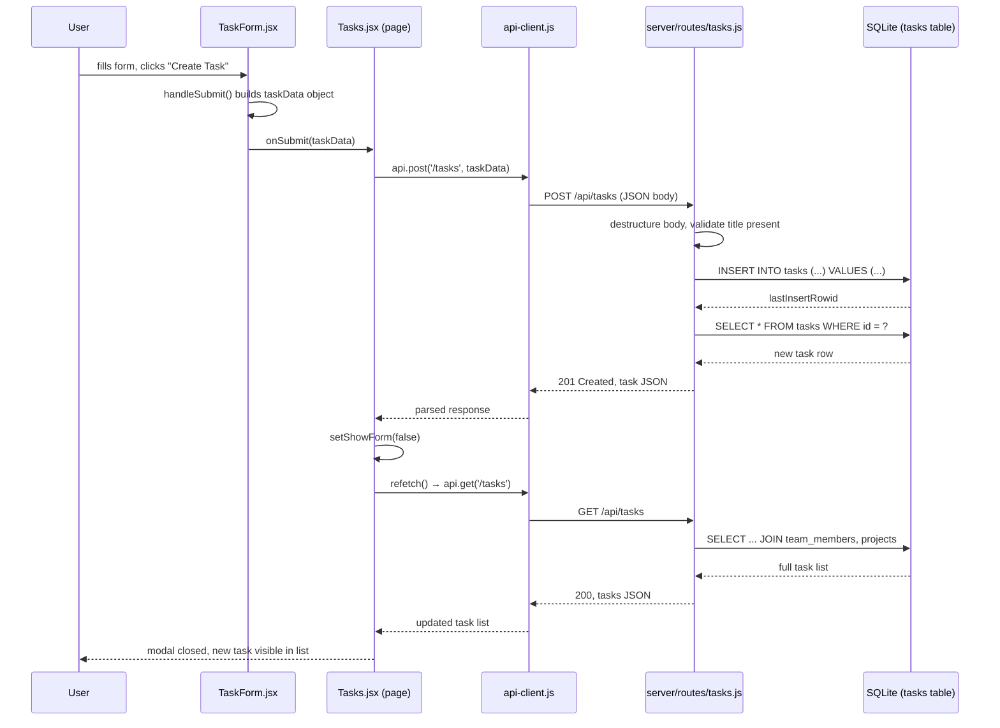

# Task Creation Flow

Trace of what happens between clicking "Create Task" and the new task appearing in the list.

## Sequence Diagram

## Step by Step

1. **`client/src/components/tasks/TaskForm.jsx`** — the form holds eight fields in local `useState` (title, description, status, priority, assignee, project, due date, estimated hours). On submit, `handleSubmit` builds a `taskData` object (mapping camelCase state to the snake_case field names the API expects, e.g. `assigneeId` → `assignee_id`) and calls the `onSubmit` prop it was given.

2. **`client/src/pages/Tasks.jsx`** — passes `handleCreate` as that `onSubmit`. It calls `api.post('/tasks', taskData)`, then on success closes the modal (`setShowForm(false)`) and calls `refetch()` to reload the task list. No optimistic update: the UI waits for the round trip.

3. **`client/src/utils/api-client.js`** — `api.post` calls the shared `apiClient()` helper, which prefixes the endpoint with `/api`, JSON-stringifies the body, and does a plain `fetch`. In dev, Vite's proxy forwards `/api/*` from port 5173 to the Express server on port 3001.

4. **`server/routes/tasks.js`, `POST /`** — destructures the body, validates that `title` is present (400 if not), then runs a parameterized `INSERT` via `better-sqlite3`. Everything else defaults server-side: `status` defaults to `'todo'`, `priority` to `'medium'`, `estimated_hours` to `0`.

5. **Database** — `server/db/schema.sql` defines the `tasks` table with `CHECK` constraints on `status` and `priority` (so an invalid value throws at the DB layer, not just the UI) and foreign keys to `team_members` and `projects`.

6. **Response and refresh** — the route re-selects the new row by `lastInsertRowid` and returns it with `201`. Back in `Tasks.jsx`, `refetch()` fires a fresh `GET /api/tasks` (joined with assignee name and project name) and the list re-renders with the new task included.

## The payoff

One button. Six files deep: `TaskForm.jsx` → `Tasks.jsx` → `api-client.js` → `tasks.js` (route) → `schema.sql` (constraints) → back up through the refetch. Every layer has to work for that one click to do what the user expects — the form has to send the right shape, the route has to validate it, the database has to accept it, and the refetch has to actually show it.
